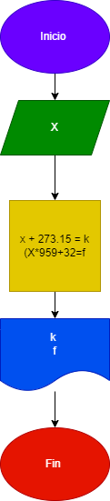

# Analisar , Diseñar y contruir un programa de convertidor una cantidad dada de grados a su equivalente a °K y °F  

## Diagrama de flujo 
Programa el cual convierta grados a kelvin y a Fahrenheit

